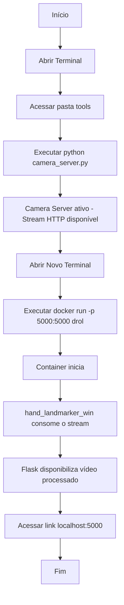

# Conflitos em relação ao Windows

Pelo fato do Docker funcionar com uma espécie de ambiente virtual Linux, ferramentas como acesso à câmera e exibição de interface são limitadas e precisam de várias dependências para que sejam acessadas. Necessitam do tempo que não temos.

# Contornando o muro

Para contornar esse problema, resolvi criar um arquivo separado, temporário, uma versão do `hand_landmarker.py` para Windows, apelidado criativamente de `hand_landmarker_win.py.`

A principal diferença do `hand_landmarker_win.py` é que, em vez de utilizar janelas locais do OpenCV para exibir a câmera com os pontos de detecção, ele implementa uma interface web utilizando Flask, disponibilizando o vídeo processado por meio de uma página acessível no navegador.

Ele funciona em conjunto com o `camera_server.py`, que deve ser executado previamente. Esse arquivo é responsável por capturar a imagem da câmera local e disponibilizá-la como um stream HTTP, permitindo que o `hand_landmarker_win.py` consuma esse fluxo para realizar o processamento das landmarks.

### Fluxograma para iniciar o projeto após a atualização:

# Documentação

A documentação está sendo realizada no Obsidian, software offline, por conta disso resolvi mover a pasta onde a documentação está salva para dentro da pasta de desenvolvimento. 

Os arquivos serão atualizados após realizarmos os famosos "commits" no [[Github]] (ambiente de armazenamento, versionamento e gerenciamento de projetos).